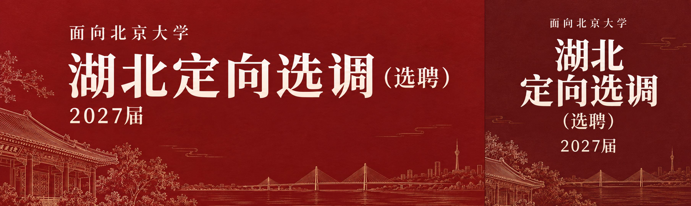

# 红色公告封面示例：2027 湖北定向选调

## 用户反馈

2026-09-12 用户认可：“这次生成的效果和风格不错，就是比例没严格按照，裁剪需要轻微调整。”

本例是**风格获认可、比例仍需改进**的参考，不是微信后台裁切已通过验收的精确布局模板。

## 值得沿用

- 深红纸纹背景、清晰白色宋体大字，底部少量金色校园屋檐和江桥线描。
- 主次明确、文字少，只放“面向北京大学”“湖北定向选调（选聘）”“2027届”。
- 左侧横版与右侧方版分别完整构图，方版重新分行，不直接截取横版中央。
- 不放报名条件、电话、密集说明或虚构的官方徽章；建筑只是 AI 装饰插画，不作为纪实照片。

## 存档文件

- `hubei-2027-generated-original.png`：内置 image_gen 的原始生成图，实际 2164 × 727。
- `hubei-2027_cover_2_35x1.png`：横版导出，2538 × 1080。
- `hubei-2027_cover_1x1.png`：方版导出，1080 × 1080。
- `hubei-2027_cover_combined_for_wechat_crop.png`：拼接导出，3618 × 1080，分界 x=2538。

## 比例问题与下次做法

原始生成图虽在提示词中要求 3618 × 1080 和固定分界，实际画布及内部比例仍有偏差。此次按 x=1488 拆成 1488 × 727 与 676 × 727 两块，再分别等比裁切、缩放到标准尺寸后拼接。最终文件像素尺寸准确，不代表原始构图或微信裁切体验已经准确；用户仍反馈需要微调。

下次应分别准备横版、方版，在各自目标比例下完成构图后再拼接。横版为 2538 × 1080（2.35:1），方版为 1080 × 1080（1:1），合成为 3618 × 1080。不拉伸字体，不仅通过改变整张拼接图尺寸来纠正比例。每块的完整标题和年份都要留出安全边距，并分别检查两种裁切窗口；未经微信后台验证，不声称裁切已验收。

## 生成提示词要点

内置 image_gen；微信公众号公告封面；深红纸纹底、白色清晰中文、低调金色校园屋檐与江桥线描；两块独立构图，无人物，无官方徽章，无额外口号。横版：“面向北京大学”“湖北定向选调（选聘）”“2027届”。方版：顶部“面向北京大学”，下方“湖北”“定向选调”“（选聘）”“2027届”分行。此次直接生成拼接画布的方式仅作历史记录，下次采用分别构图后拼接。

项目来源：`/Users/AntiEntropy/Documents/荆楚协会/posts/2027-湖北定向选调公告/assets/wechat_cover_outputs/`。
