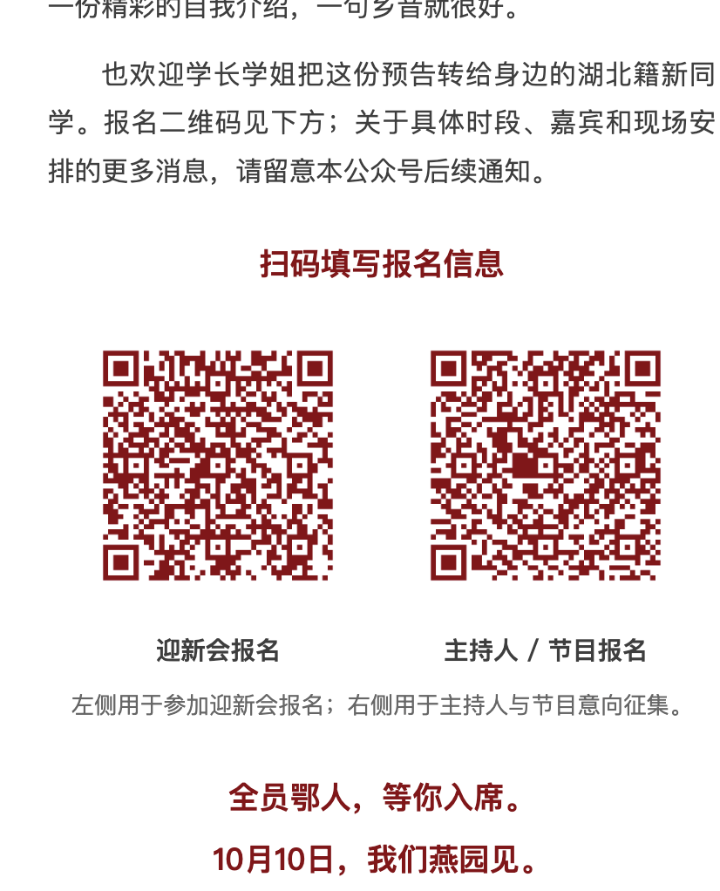

# 微信素材库外链：二维码成功案例

2026-09-14，北大湖北籍迎新推送的两张报名二维码通过以下路径成功显示：用户上传原图到公众号素材库，保存素材库网页 HTML，提取微信 CDN 地址，再将地址嵌入推送 HTML。用户提供下方截图确认显示成功；未单独确认保存草稿后重新打开的持久性测试，不将截图视为这一额外步骤的证据。

## 可复用步骤

1. 将命名明确的原图上传到公众号素材库。无需 AppSecret。
2. 用户在浏览器保存素材库页面 HTML；不必逐张手动复制地址。
3. 使用 HTML 解析器按 `strong.weui-desktop-img-picker__img-title` 的完整文件名匹配所属 `li.weui-desktop-img-picker__item`。
4. 本次图片位于 `i.weui-desktop-img-picker__img-thumb` 的内联 `background-image: url(...)` 中，不在 ``。解析 CSS URL，并正确处理 HTML 实体；本次解析后的属性仍含 `&amp;`，需再解码为 `&`。
5. 直接请求提取的微信 CDN 地址，核对实际尺寸与原图内容。本次两个 `/640?wx_fmt=png&from=appmsg` 地址均返回 HTTP 200、image/png、900×900 图片，与本地原图逐像素一致。保留实际观察到的 URL，不擅自改写为 `/0`。
6. 将 URL 写入文章的 `content-spec.json`，重新生成 full 和 fragment，确保两个输出的 `src`、`data-src` 一致，版式及二维码白边保持不变。
7. 在微信后台测试导入显示，并建议保存草稿、重新打开后再检查。分别记录 HTTP、原图一致性、用户显示确认与保存重开测试状态。

不把整个素材库 HTML 收录进 skill 或公开仓库：它可能包含账号信息和登录态页面参数。这里只保存用户指定的成功截图，不保存后台 token。

## 本次文件对应

- `2026-10-10-北大湖北籍迎新会报名二维码.png`：`assets/qr-welcome-registration.png`。
- `2026-10-10-主持人及节目报名二维码.png`：`assets/qr-host-program.png`。
- 文章目录：`~/Documents/荆楚协会/posts/2026-10-10-湖北籍迎新预热/`。
- 精确 URL 与图片验证结果：文章目录的 `wechat-material-qr-manifest.json`。

## 用户确认截图

